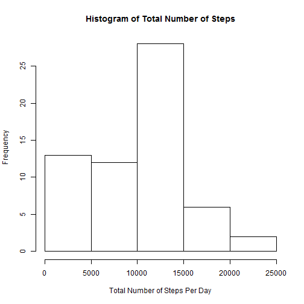
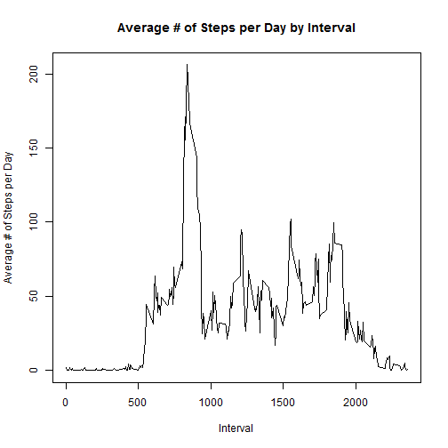
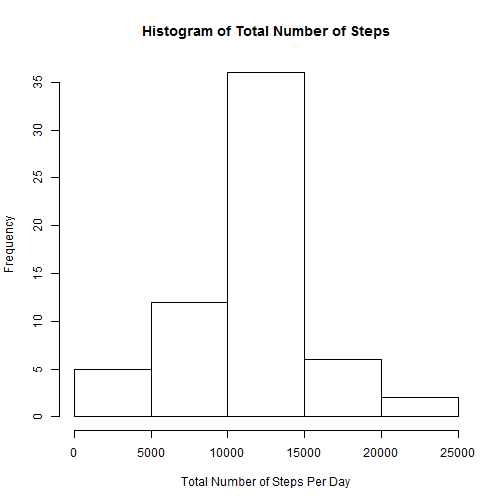
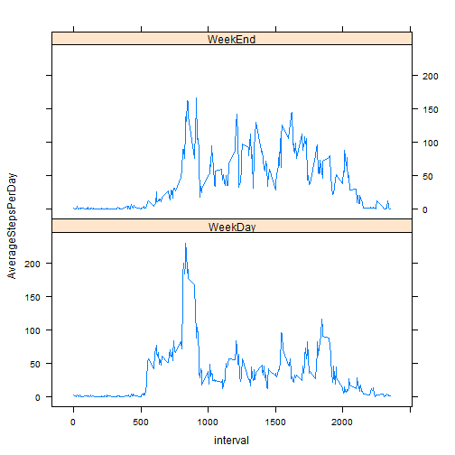

#Step 1: Loading and preprocessing the data

Show any code that is needed to

Load the data (i.e. read.csv())

Process/transform the data (if necessary) into a format suitable for your analysis

---


```r
z <- getwd()
fileurl = 'https://d396qusza40orc.cloudfront.net/repdata%2Fdata%2Factivity.zip'
download.file(fileurl,destfile = './repdata-data-activity.zip',method='curl')
```

```
## Warning: running command 'curl
## "https://d396qusza40orc.cloudfront.net/repdata%2Fdata%2Factivity.zip" -o
## "./repdata-data-activity.zip"' had status 127
```

```
## Warning in download.file(fileurl, destfile =
## "./repdata-data-activity.zip", : download had nonzero exit status
```

```r
unzip(zipfile='./repdata-data-activity.zip',list=FALSE,overwrite=TRUE)
activity <- read.csv("activity.csv")
library(dplyr)
```

```
## 
## Attaching package: 'dplyr'
## 
## The following object is masked from 'package:stats':
## 
##     filter
## 
## The following objects are masked from 'package:base':
## 
##     intersect, setdiff, setequal, union
```

```r
library(knitr)
library(ggplot2)
library(lattice)
a <- group_by(activity,date)
```

---

#Step 2: What is mean total number of steps taken per day?

For this part of the assignment, you can ignore the missing values in the dataset.

Calculate the total number of steps taken per day

If you do not understand the difference between a histogram and a barplot, research the difference between them. Make a histogram of the total number of steps taken each day


Calculate and report the mean and median of the total number of steps taken per day

---


```r
b <- summarize(a,TotalSteps=sum(steps,na.rm=TRUE)) 
c <- mean(b$TotalSteps,na.rm=TRUE)
d <- quantile(b$TotalSteps,probs = 0.5)
print("Total # of Steps taken per day:")
```

```
## [1] "Total # of Steps taken per day:"
```

```r
print(b)
```

```
## Source: local data frame [61 x 2]
## 
##          date TotalSteps
## 1  2012-10-01          0
## 2  2012-10-02        126
## 3  2012-10-03      11352
## 4  2012-10-04      12116
## 5  2012-10-05      13294
## 6  2012-10-06      15420
## 7  2012-10-07      11015
## 8  2012-10-08          0
## 9  2012-10-09      12811
## 10 2012-10-10       9900
## ..        ...        ...
```

```r
print("Histogram of the Total Steps")
```

```
## [1] "Histogram of the Total Steps"
```

```r
hist(b$TotalSteps,xlab="Total Number of Steps Per Day",main = "Histogram of Total Number of Steps")
```

 

```r
cat("Mean # of Total Steps each day =",c)
```

```
## Mean # of Total Steps each day = 9354.23
```

```r
cat("Median of Total Steps each day =",d)
```

```
## Median of Total Steps each day = 10395
```

---

#Step 3 : What is the average daily activity pattern?

Make a time series plot (i.e. type = "l") of the 5-minute interval (x-axis) and the average number of steps taken, averaged across all days (y-axis)

Which 5-minute interval, on average across all the days in the dataset, contains the maximum number of steps?

---


```r
a <- group_by(activity,interval)
b <- summarize(a,AverageStepsPerDay=mean(steps,na.rm=TRUE))
plot(x=b$interval,y=b$AverageStepsPerDay,type="l",xlab="Interval",ylab="Average # of Steps per Day",main="Average # of Steps per Day by Interval")
```

 

```r
c <- max(b$AverageStepsPerDay,na.rm=TRUE)
d <- b$AverageStepsPerDay == c
e <- b$interval[d]
cat("The 5-minute interval which on average across all the days in the dataset contains the maximum number of steps is ",e)
```

```
## The 5-minute interval which on average across all the days in the dataset contains the maximum number of steps is  835
```

---

#Step 4: Imputing missing values

Note that there are a number of days/intervals where there are missing values (coded as NA). The presence of missing days may introduce bias into some calculations or summaries of the data.

Calculate and report the total number of missing values in the dataset (i.e. the total number of rows with NAs)

Devise a strategy for filling in all of the missing values in the dataset. The strategy does not need to be sophisticated. For example, you could use the mean/median for that day, or the mean for that 5-minute interval, etc.

Create a new dataset that is equal to the original dataset but with the missing data filled in.

Make a histogram of the total number of steps taken each day and Calculate and report the mean and median total number of steps taken per day. Do these values differ from the estimates from the first part of the assignment? What is the impact of imputing missing data on the estimates of the total daily number of steps?

## Strategy for filling in the missing values is :
1. Within each interval, for each individul day, get the average of the steps per day
2. Within each interval, for each individuale day, the missing values can be replaced by the average computed earlier.
3. Check those intervals where values are missing for entire day
4. Compute interval level averages steps per day 
5. For missing values found in step 3, replace the missing values with averages found in the step 4 above. 

---


```r
NumberofNAs <- sum(is.na(activity$steps)) + sum(is.na(activity$date)) + sum(is.na(activity$interval))
cat("Total Number of NAs = ",NumberofNAs)
```

```
## Total Number of NAs =  2304
```

```r
a <- group_by(activity,interval,date)
b <- summarize(a,NumberofNAs=sum(is.na(steps)),NumberofProperEntries=sum(!(is.na(steps))),AverageStepsPerDay=mean(steps,na.rm=TRUE))
c <- group_by(activity,interval)
d <- summarize(c,AverageStepsPerDay=mean(steps,na.rm=TRUE))
e <- a

for(i in 1:nrow(a))
{
  if (is.na(e[[1]][i])) 
	{
		f <- ((b$interval == e[[3]][i]) & (b$date == e[[2]][i]))
		e[[1]][i] = b$AverageStepsPerDay[f]
	}
	if (is.na(e[[1]][i]))
	{
		f <- (d$interval == e[[3]][i]) 
		e[[1]][i] = d$AverageStepsPerDay[f]
	}
	

}

f <- group_by(e,date)
g <- summarize(f,TotalSteps=sum(steps,na.rm=TRUE))
h <- mean(g$TotalSteps,na.rm=TRUE)
i <- quantile(g$TotalSteps,probs = 0.5)
cat("Mean=",h)
```

```
## Mean= 10766.19
```

```r
cat("Median=",i)
```

```
## Median= 10766.19
```

```r
hist(g$TotalSteps,xlab="Total Number of Steps Per Day",main = "Histogram of Total Number of Steps")
```

 

---

#Step - 5: Are there differences in activity patterns between weekdays and weekends?

For this part the weekdays() function may be of some help here. Use the dataset with the filled-in missing values for this part.

Create a new factor variable in the dataset with two levels - "weekday" and "weekend" indicating whether a given date is a weekday or weekend day.

Make a panel plot containing a time series plot (i.e. type = "l") of the 5-minute interval (x-axis) and the average number of steps taken, averaged across all weekday days or weekend days (y-axis). See the README file in the GitHub repository to see an example of what this plot should look like using simulated data.

---


```r
a <- group_by(e,date)
a$Date2 <- as.Date(a$date)
a$Weekday <- weekdays(a$Date2)
a$WeekDayEnd <- "WeekDay"
a$WeekDayEnd[a$Weekday %in% c("Sunday","Saturday")] <- "WeekEnd"
a$WeekDayEnd <- as.factor(a$WeekDayEnd)
b <- group_by(a,interval,WeekDayEnd)
c <- summarize(b,AverageStepsPerDay=mean(steps,na.rm=TRUE))  


library(lattice)
xyplot(AverageStepsPerDay~interval|WeekDayEnd,data=c,layout=c(1,2),type="l")
```

 


